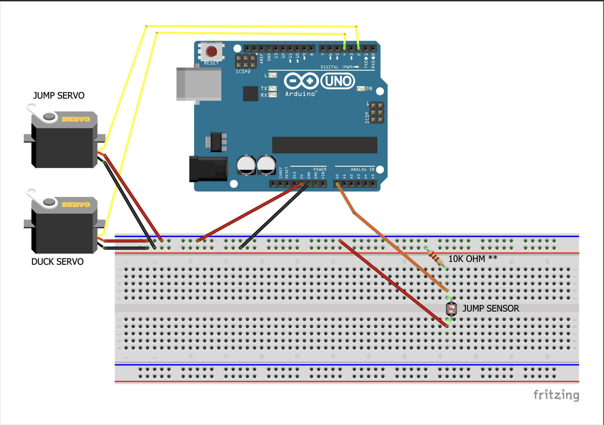

# Arduino T-Rex Run
A small project to use an Arduino UNO to play Google's T-Rex run game (no machine learning or AI involved).

## After cloning project
1. Open the "schematic.pdf" file and set up Arduino based on it. Keep in mind it is a 10k OHM resistor being used (the program I used to create the schematic did not have the proper resistor image).
2. Set up the jump sensor on the computer's screen (about 1/4 from the left hand side this can vary)
3. Set up the servos on the keyboard (try to get them pressed down as possible so they do not move)
4. Open Google Chrome and type "chrome://dino/" to access the game. 
5. Open the t-rex-run.ino and upload it to your Ardunio (this example uses an UNO). 
6. Run some tests and update the "Servo positions" and "Sensor object values" to best suit your set up. 
7. Run some tests
8. Volia! Hopefully now you can watch your Arduino play T-Rex run for you! 

## Schematic

## Notes
* Watch the t-rex-run-demo.mp4 if you want to see how I had it set up. 
* This project is not perfect and tends to glitch sometimes when transitioning between night and day quickly. 
* The main purpose of this project was to apply KISS (Keep It Simple Stupid) so feel free to add on to it :) 
* The idea of this project originally came from a Facebook post a friend shared with me and I wanted to try it out.